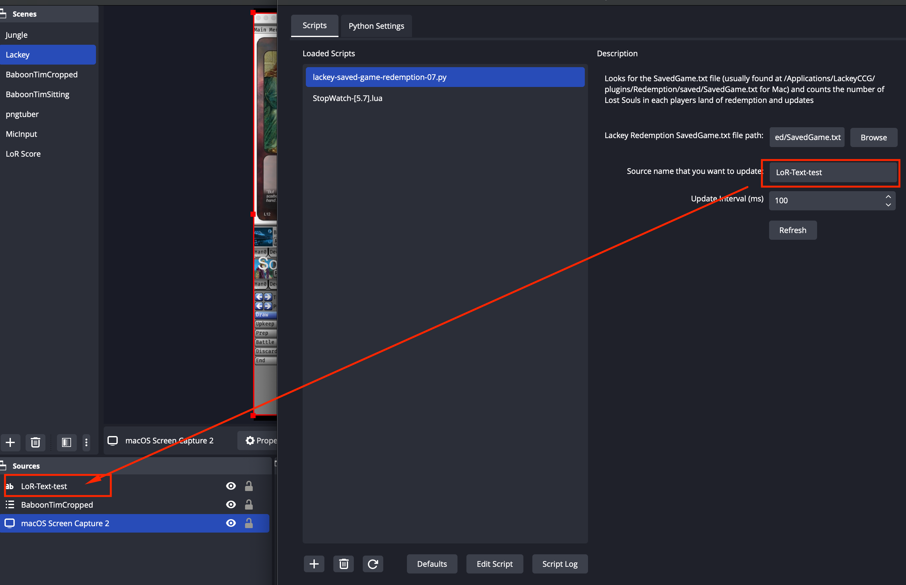
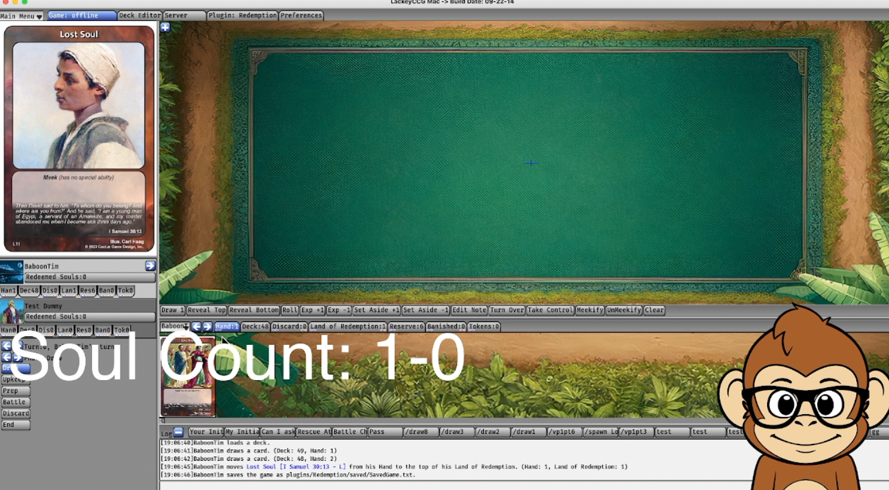

## Installation

### 1) First, you need to enable Python on your OBS system if you haven't already.

Go to OBS -> Tools -> Scripts -> Python Settings

Paste the Install Path for your Python3 installation.

(Mine was in `/opt/homebrew/Cellar/python@3.11/3.11.5/Frameworks`). This version of python was installed via homebrew. Good luck trying to find the path to your Python package.)

### 2) Create a text source in OBS
Remember what you name this source. You'll need it in the next step.

### 3) Then you'll want to add the script to OBS

Save `lackey-saved-game-redemption-15.py` to a safe place on your computer.

Go to OBS -> Tools -> Scripts -> Plus Button -> and add `lackey-saved-game-redemption-15.py`

Reopen OBS -> Tools -> Scripts then input the settings:

- Your SavedGame.txt should match the SavedGame.txt path for your Lackey Redemption Plugin.
(Mine was at `/Applications/LackeyCCG/plugins/Redemption/saved/SavedGame.txt`)

- Your Source Name should match a text source in OBS!

- Your Lackey User Name should match your username you have in Lackey (optional, used for sorting the output)

### 4) Once the Script is ready, open up lackey and drag a card into the Land of Redemption, then **save the game**.

**The script won't update the text source unless you save the game file.** Its important to save the game in order for the text to update.

If everything is working, you should see your text source being updated as you add cards to the land of redemption and saving the game!

## If you don't see the score updating, make sure to save the game, then check if it updates!